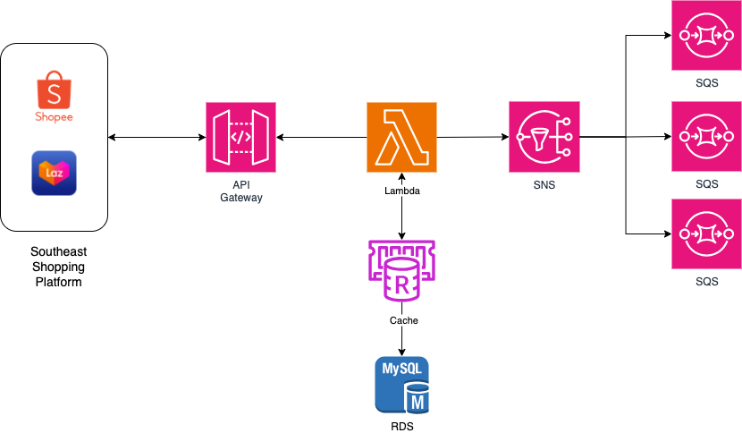

# Background
At Gomi Corporation, as a commerce platform, there was a requirement to integrate and manage orders from Southeast Asian shopping platforms such as Shopee and Lazada. Since each shopping platform offered webhooks, we leveraged them to implement the order management system.

**We selected an asynchronous architecture for the following reasons**:
- During major events like promotions and big sales, the platform experiences a surge in order volume.
- Since most external shopping platform webhooks had short timeouts, we responded quickly and processed the data asynchronously within our system.
- Processing orders immediately would complicate retries and fault recovery.

# Details

**Southeast Shopping Platform**: Based on webhooks provided by Southeast Asian shopping platforms, order events are delivered to our internal servers.

**API Gateawy**: To prevent Lambda overload during webhook event spikes, we implemented traffic control to regulate the delivery rate. Additionally, by attaching ACM certificates, we automated HTTPS and TLS management, maximizing production efficiency.

**Lambda**: Since Lambda automatically scales concurrent executions as requests increase, it can easily handle traffic spikes and offers cost advantages. In particular, its seamless integration with other AWS services such as API Gateway, SNS, and SQS makes it highly efficient for operations

**Cache**: Introduced a cache layer in AWS Lambda to quickly filter duplicate events using idempotency keys, and applied a cache-aside pattern to maximize cache hit rates before querying external data sources, minimizing processing delays.

**SNS**: Implemented a Pub/Sub architecture using SNS topics to publish order events, allowing multiple subscriber services to consume events independently, enhancing system scalability and event processing flexibility

**SQS**: Implemented SQS FIFO queues to meet sequential processing requirements for order events, grouping messages by `MessageGroupId = shopId:orderId` to ensure order-level sequencing while processing different order groups in parallel, optimizing throughput and response times.
